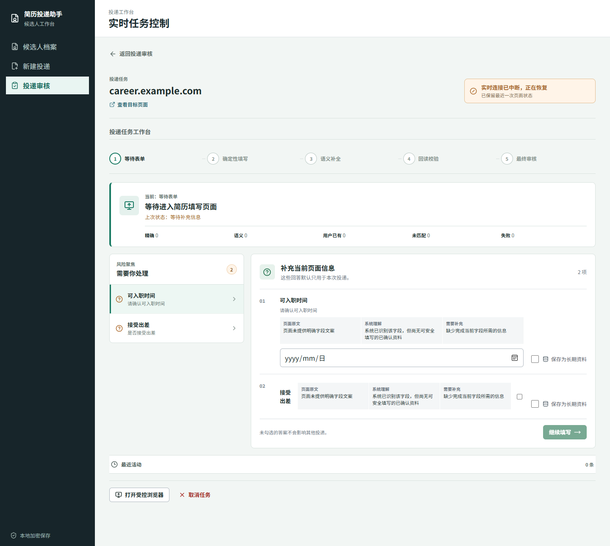
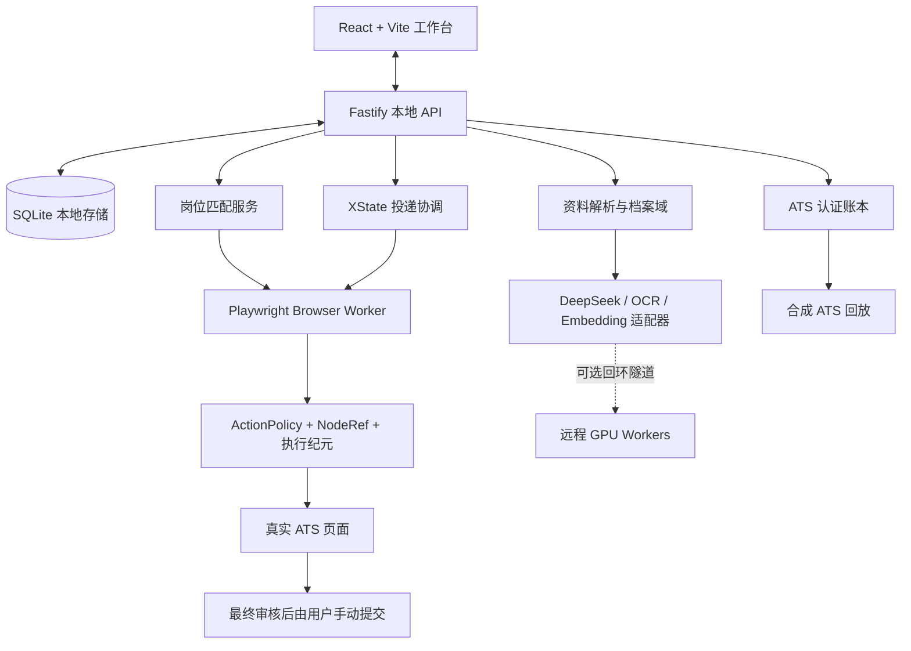
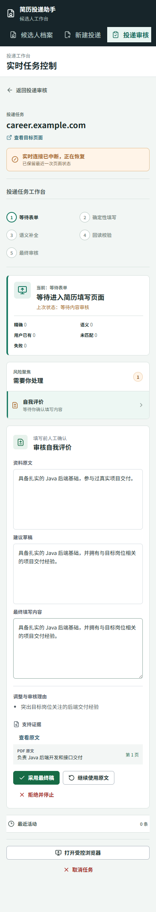

# Appliot

> 从 PDF 证据到岗位选择、从受控填写到人工终审的本地简历投递工作台。

Appliot 是一个面向个人使用的、本地优先的简历资料管理与投递辅助项目。它把 PDF 简历转化为带原文证据的候选人档案，结合岗位期望完成可解释的岗位匹配，并在受控浏览器中协助填写招聘表单。

自动化的终点是最终审核，不是最终提交。系统不会替用户点击“提交申请”“发送申请”“确认投递”等终局操作。

<p align="center">
  
</p>

*上图由浏览器回归测试生成，岗位地址、字段和内容均为合成数据。*

## 为什么是 Appliot

招聘自动化最难的部分不是把文本输入框填满，而是确保每个动作都有来源、边界和回读结果。Appliot 把这件事拆成可审阅的环节：

| 能力 | 做什么 | 如何保持可控 |
| --- | --- | --- |
| 简历知识化 | PDF 文本直读优先，必要时 OCR 回退；抽取结构化事实与原文证据 | 抽取结果先进入待确认状态，未经用户确认不会直接用于填写 |
| 候选人档案 | 维护长期档案、任务专属答案和版本记录 | 任务答案默认不扩散到长期档案或其他投递 |
| 岗位匹配 | 根据岗位期望执行硬条件筛选、Trigram/Dense 混合召回和可解释排序 | 用户自己选择岗位，匹配模块没有最终提交权限 |
| 受控填写 | 观察表单、填写字段、稳定双回读、执行必要的中间步骤 | `NodeRef`、执行纪元、ActionPolicy 与 XState 状态机共同约束写入 |
| ATS 认证 | 未知页面先只读观察，使用合成资料回放、AI 审阅和人工认证生成提示包 | 未认证页面禁止真实写入；提示包不是可执行脚本 |
| 风控与审计 | 验证码、403、429、设备验证、风控、iframe/Shadow DOM 边界自动暂停 | 生产账本仅保存脱敏结构化结果；调试原文需显式加密配置且有 TTL |

## 一分钟启动

### 前置条件

- Windows 10/11
- Node.js `24.14.1` 或更高版本
- Corepack（Node.js 自带）

在项目根目录执行：

```powershell
corepack enable
corepack pnpm install --frozen-lockfile
corepack pnpm dev
```

`pnpm dev` 会并行启动本地 API 和 Vite Web。浏览器打开 [http://127.0.0.1:5173](http://127.0.0.1:5173) 后即可进入工作台；API 只监听本机回环地址 `127.0.0.1:43120`。

基础工作台可以在没有模型凭据时启动。若要启用 PDF OCR、Dense 检索、语义辅助或 AI 适配审阅，先创建本地配置：

```powershell
if (-not (Test-Path .env.local)) { Copy-Item .env.example .env.local }
```

按 `.env.example` 中的说明取消注释并填写已部署服务对应的整组变量。`.env.local` 被 Git 忽略，绝不应提交 API Key、Token、Cookie、浏览器配置或候选人资料。

### 长期运行

当远程 OCR 与 Embedding Worker 已部署并且本机已配置无交互 SSH 后，可安装登录后自启的本地服务：

```powershell
.\scripts\service-control.ps1 install `
  -SshHost "REMOTE_HOST" `
  -SshUser "REMOTE_USER" `
  -SshPort 22 `
  -RemoteRoot "/home/REMOTE_USER/resume-ai"
```

安装完成后可使用：

```powershell
corepack pnpm services:status
corepack pnpm services:start
corepack pnpm services:stop
```

完整的远程 Worker 部署与验收过程见 [远程部署手册](docs/deployment/remote-codex-handoff.md)。

## 产品流程


每条自动填写答案都有资料来源、证据和置信度。资料不足、信息冲突、低置信度或不支持字段都会转为追问、待审或人工接管，而不是猜测填写。

## 安全边界

| 系统会做 | 系统不会做 |
| --- | --- |
| 填写普通字段、验证回读、执行经策略批准的中间保存或下一步 | 点击最终提交、发送申请、确认申请或任何不可逆投递动作 |
| 在验证码、风控、HTTP 403/429、设备验证、iframe 与 Shadow DOM 边界暂停 | 绕过登录、验证码、MFA、站点风控或访问控制 |
| 保存本地资料、任务检查点和脱敏审计结果 | 读取招聘站 Cookie、保存招聘站密码或上传未审阅的候选人资料 |
| 对未知 ATS 生成脱敏候选映射并进行合成回放 | 让 AI、提示包或未经认证的页面直接写入真实招聘表单 |

最终提交禁止由两侧共同保证：浏览器动作策略拒绝终局控件，投递状态机也会在最终审核阶段锁定任务。即使提示包完成认证，这个约束也不变。

## 架构



组件职责：

- `apps/web`：React 工作台，展示档案、岗位匹配、投递进度、追问与人工审核。
- `apps/api`：Fastify API、SQLite 持久化、资料/匹配/投递/认证服务装配。
- `apps/browser-worker`：持久化 Chromium 会话、页面观察、受控动作和回读验证。
- `packages/action-policy`：最终提交等终局动作的硬禁止策略。
- `packages/form-semantics`：字段语义、本体、Moka/Mokahr 与 DJI 提示包。
- `packages/job-matching`：岗位期望、适配器、硬条件、混合召回和排序解释。
- `packages/profile-domain`、`packages/rag`、`packages/model-provider`：简历抽取、证据检索与模型适配。

## ATS 支持范围

当前的生产写入范围是明确收敛的：

| 场景 | 当前行为 |
| --- | --- |
| Moka/Mokahr 常见申请流程 | 通过内置认证提示包执行受控观察与填写，仍保留所有风险暂停和最终审核 |
| DJI 路径 | 通过内置认证提示包执行受控观察与填写，支持字段目录与重复区段处理 |
| 未知、指纹漂移或未认证的 ATS 页面 | 进入 `awaiting_adapter_review`，只读观察，不会写入真实页面 |
| 新站点适配 | 脱敏候选映射 -> 确定性合成回放 -> AI 辅助审阅 -> 人工认证 -> 版本化认证包 |

认证包是声明式映射，不是 Skill，也不是可执行脚本。详细的生命周期、回放硬门禁、账本数据边界和调试留存规则见 [ATS 适配认证手册](docs/ats-adapter-certification.md)。

## 脱敏界面示例

<p align="center">
  
</p>

*该截图来自 Mock API，不包含真实候选人或招聘站数据。界面只提供“采用最终稿”“继续使用原文”“拒绝并停止”等受控操作，不提供自动提交。*

## 常用命令

| 命令 | 用途 |
| --- | --- |
| `corepack pnpm dev` | 同时启动 API 与 Web 开发服务 |
| `corepack pnpm test` | 运行所有单元和集成测试 |
| `corepack pnpm test:e2e` | 运行 Playwright 浏览器回归 |
| `corepack pnpm typecheck` | TypeScript 类型检查 |
| `corepack pnpm build` | 构建所有工作区包 |
| `corepack pnpm start:api` | 启动已构建的 API |
| `corepack pnpm start:web` | 提供已构建的 Web 静态文件并代理 `/api` |
| `corepack pnpm services:status` | 查看已安装的本地服务状态 |

## 开发与验证

```powershell
corepack pnpm typecheck
corepack pnpm build
corepack pnpm test
corepack pnpm test:e2e
```

浏览器回归覆盖合成 ATS、岗位匹配、Moka/Mokahr、DJI、未知页面只读认证、挑战暂停、稳定回读和“最终提交次数为 0”等关键边界。真实招聘页面验证也必须停在最终审核，不得点击提交控件。

## 文档索引

- [ATS 适配认证运行手册](docs/ats-adapter-certification.md)
- [国内 ATS 回归检查](docs/testing/domestic-ats-regression.md)
- [ATS Runtime P0 回归检查](docs/testing/ats-runtime-p0-regression.md)
- [远程 GPU Worker 部署](docs/deployment/remote-gpu.md)
- [远程部署执行手册](docs/deployment/remote-codex-handoff.md)

## Roadmap

- 将 LangGraph 作为高层 Agent 编排器，保留 XState 与 ActionPolicy 作为不可绕过的受控执行内核。
- 扩大经过合成回放和人工认证的国内 ATS 适配包，而不是把未知页面直接纳入写入范围。
- 扩展岗位期望、匹配解释和人工审核体验，同时保持候选人资料的本地优先边界。

## 贡献前须知

请不要提交 `.env.local`、数据库、真实简历、截图中的 PII、Cookie、Token、浏览器 profile 或真实招聘站页面源码。涉及 ATS 行为的改动必须保留“最终提交为零”的回归断言，并优先使用合成页面与合成资料验证。
