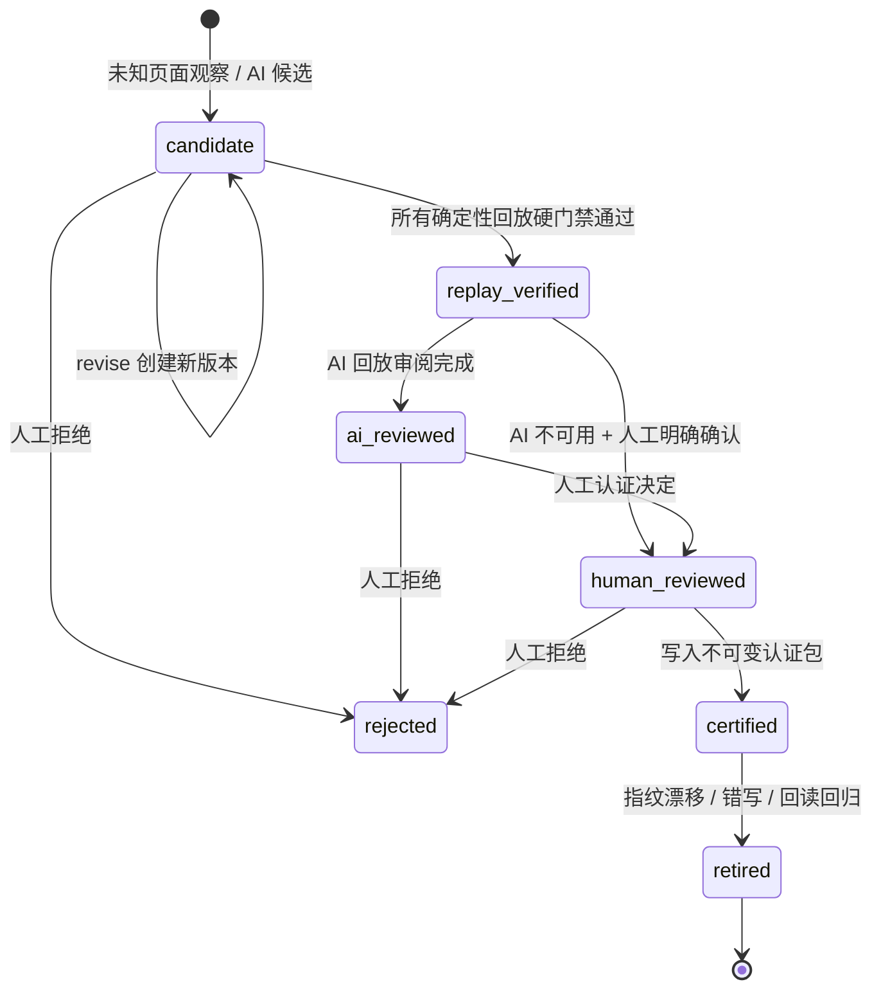

# ATS 适配包认证运行手册

本文说明未知招聘页面如何进入认证流程，以及认证后如何安全地使用本地 ATS 提示包。认证对象是版本化的声明式映射数据，不是可执行脚本，也不是 Codex Skill。

## 1. 安全边界

- 未匹配到已认证提示包的页面只允许观察和生成脱敏候选映射，状态为 `awaiting_adapter_review`，在认证前不会向真实页面写入字段。
- 认证流程只使用合成 ATS 页面和合成资料回放，不需要真实招聘账号、真实简历或真实投递。
- 受控执行仍由 `ActionPolicy`、`NodeRef`、快照/变更纪元、稳定双回读和挑战暂停共同约束。验证码、403、429、设备验证、风控、未支持的 iframe 或 Shadow DOM 都会转人工处理。
- 最终提交、发送申请、确认申请等终局操作始终被禁止。认证成功也不会自动恢复真实页面，必须由用户点击“适配包已认证，重新观察”。

## 2. 生命周期



| 状态 | 含义 | 是否允许真实页面写入 |
| --- | --- | --- |
| `candidate` | 已保存的脱敏候选定义，尚未通过完整回放 | 否 |
| `replay_verified` | 所有 fixture 的确定性断言通过 | 否，仍需 AI 或显式降级确认 |
| `ai_reviewed` | AI 只读审阅了已通过的回放结果 | 否，仍需人工决定 |
| `human_reviewed` | 人工提交了“认证”决定，待生成认证包 | 否 |
| `certified` | 生成不可变的 `packId@version`，可被注册表解析 | 仅在现有受控执行规则允许时 |
| `rejected` | 当前候选被拒绝 | 否 |
| `retired` | 已认证版本被退休，注册表不再解析 | 否 |

AI 不可用时，唯一允许的降级路径是 `replay_verified -> human_reviewed`。人工必须勾选“我已确认 AI 审阅不可用，仍由人工承担最终判断”；没有这个确认，认证请求会被拒绝。AI 建议不能覆盖任何确定性失败。

## 3. 三层认证流程

### 第一层：通用观察与 AI 候选

系统从页面快照中提取站点、路径、控件类型、字段标签、分区和重复区段等结构化信号，并对文本做哈希引用。发送给模型的内容不包含真实档案值、完整 HTML、截图中的 PII、Cookie、凭据、`NodeRef`、审批令牌或浏览器命令。

模型只能返回严格契约中的 `HintPackDefinition`：字段语义路径、标签别名、控件/分区兼容性、重复操作类别和合成 fixture。候选永远是 `candidate`，不能直接成为生产填写来源。

### 第二层：确定性合成资料回放

回放在隔离的合成 ATS 上通过现有受控浏览器路径执行。认证前不会打开或写入用户的真实招聘页面。每个 fixture 至少检查：

- schema、`ActionPolicy` 和禁止终局操作；
- 字段到档案路径的一对一映射、控件类型和分区兼容性；
- 目标值是否正确写入，非目标字段是否保持不变；
- 重复区段的顺序、添加动作和边界处理；
- 稳定双回读；
- 挑战/不支持边界是否暂停；
- `submissionCount === 0`；
- 回放轨迹是否不含 PII。

任一红色断言失败，候选不能进入 `replay_verified`。AI 只能解释失败或建议修订，不能把失败改成通过。

### 第三层：AI 辅助审阅与人工最终认证

AI 只读取已经通过的回放报告，输出风险级别和建议（接受人工审阅、修订或拒绝）。AI 结果会记录模型、提示版本和哈希，但不会替代人工决定。人工应查看候选映射、每条回放断言、AI 发现和不支持边界后再作决定。

认证成功后，系统把 `packId`、版本、回放报告 ID、人工审阅 ID（以及可用时的 AI 审阅 ID）写入不可变 provenance。任务页随后仍需用户手动点击重新观察；不会因为认证 API 返回成功就自动继续真实页面。

## 4. 操作入口

任务页的“ATS 适配认证”面板展示三层结果，并始终显示 `writeBlocked: true`，直到注册表解析到认证版本。也可以通过本地 API 查看或推进流程：

```text
GET  /api/ats-adapters/proposals/:proposalId
POST /api/ats-adapters/proposals/:proposalId/replay
POST /api/ats-adapters/proposals/:proposalId/ai-review
POST /api/ats-adapters/proposals/:proposalId/revise
POST /api/ats-adapters/proposals/:proposalId/decision
POST /api/ats-adapters/packs/:packId/:version/retire
```

建议顺序如下：

1. 在面板中查看脱敏候选映射和不支持边界。
2. 点击“运行合成资料回放”，确认所有硬门禁均为通过。
3. 点击“请求 AI 审阅回放”；若 AI 暂不可用，确认降级提示后由人工承担判断。
4. 必要时编辑映射并保存。修订会创建新的不可变子候选，版本号递增 patch（例如 `1.0.0 -> 1.0.1`），父版本不会被覆盖，且必须从头回放。
5. 只有人工点击“认证此版本”后才会生成 `certified` 包。
6. 回到任务页点击“适配包已认证，重新观察”，让注册表重新解析当前页面。

接口返回的是脱敏 `AdapterReviewSummary`。它可用于查看 `definition.fieldRules`、`replayReports[].assertions[]`、`aiReview.findings[]` 和 `humanDecision`，但不会返回当前页面值、节点引用、Cookie、审批令牌或模型原文。

## 5. 脱敏账本与审计

生产账本只保留结构化结果：

- 匹配文本保存为 `ats:sha256:<length>:<hash>`，不能还原原文；
- 不支持边界、回放说明、AI 解释和人工备注保存为受限 `redacted:*` 枚举值；
- 生命周期、版本、输入/输出哈希、回放断言结果和人工决定可通过上面的 GET 接口查看；
- `certified` 包只从本地账本读取，退休后注册表会立即停止解析该版本。

不要直接修改 SQLite 中的生命周期或 payload。需要修订时调用 `revise` 创建新版本，需要下线时调用 `retire`，这样才能保留完整决策链和审计关系。

## 6. 调试模式原文留存

默认不留存模型原文。只有显式配置以下变量，才会短期加密保存与适配审阅相关的原始模型响应：

| 变量 | 要求 |
| --- | --- |
| `ATS_ADAPTER_DEBUG_RAW` | 必须精确为 `1` 才启用 |
| `ATS_ADAPTER_DEBUG_KEY_BASE64` | Base64 解码后必须正好 32 字节，用于 AES-256-GCM |
| `ATS_ADAPTER_DEBUG_TTL_HOURS` | 整数 `1..168`；省略时默认 `24` 小时，最大 7 天 |

原文在 SQLite 中以 AES-256-GCM 密文、随机 IV 和认证标签保存。每次读取都会写入访问审计（响应 ID 哈希、操作者哈希、时间），过期内容不可读。

当前版本没有公开的 HTTP 清理接口或独立 CLI。安全维护入口是 `DebugRawStore.purgeExpired()`；维护编排应在受控窗口调用它并记录结果，不能绕过审计直接执行任意删除。即使未立即物理删除，过期记录也不会被解密返回。后续若增加 CLI，必须复用该入口而不是复制删除 SQL。

## 7. 退休条件

出现以下任一情况，应立即通过 `POST /api/ats-adapters/packs/:packId/:version/retire` 退休版本，并以不含敏感内容的原因提交：

- 页面指纹或关键结构发生漂移；
- 发现错误字段写入、非目标字段被修改或重复区段顺序异常；
- 稳定回读失败或出现新的挑战/边界行为；
- 认证包被新版本明确取代。

退休是追加式记录，不会删除历史回放和人工决策；同一版本也不能重新激活。

## 8. 禁止输入与禁止行为

不得发送给 AI 或写入生产适配账本：

- 可直接识别个人身份的信息（姓名、手机号、邮箱、住址、身份证件等）、简历原文和档案字段值；
- Cookie、Authorization、密码、API key、SSH 私钥、浏览器 profile 数据；
- 完整 HTML、含 PII 的截图、`NodeRef`、审批 token、可执行浏览器命令；
- 任何真实 ATS 的提交、发送或确认申请动作。

发现脱敏校验失败、合成回放提交计数非零或挑战边界未暂停时，应停止认证并保留失败报告供复盘，不得手工修改账本绕过硬门禁。
