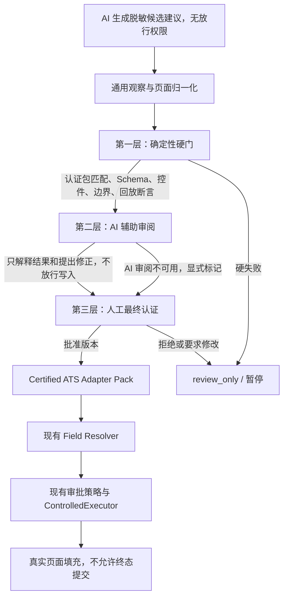
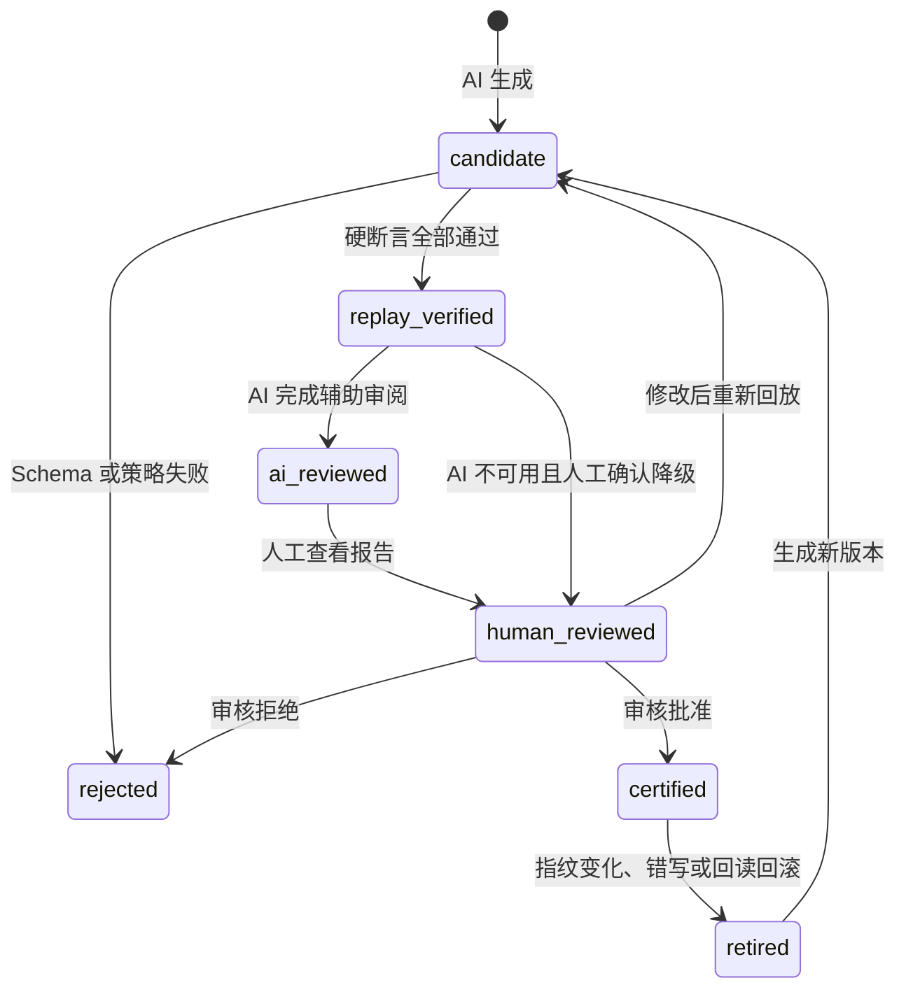
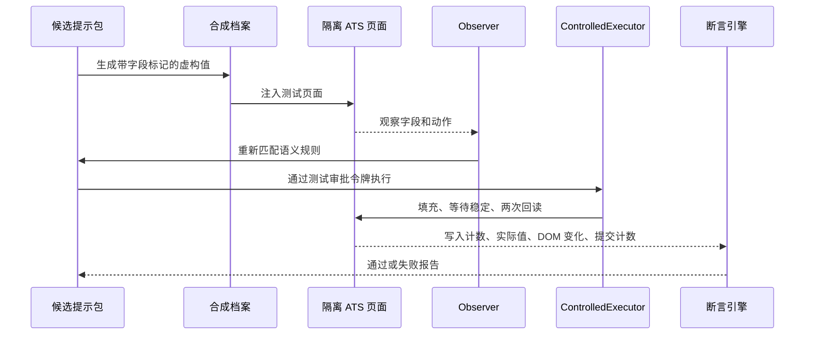
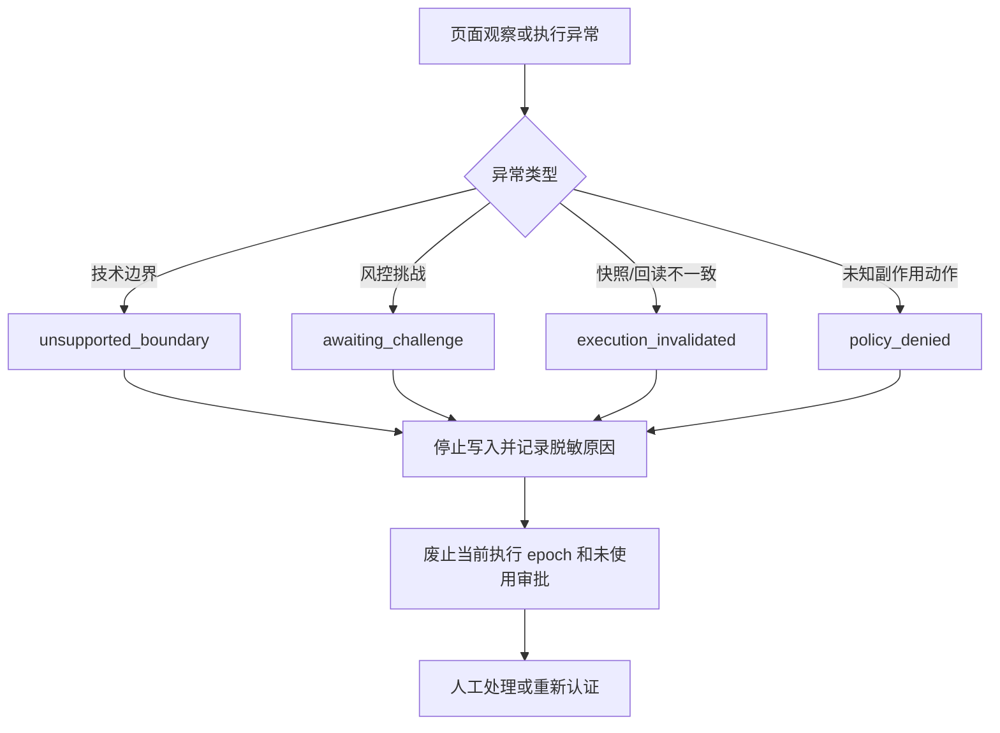

# 认证 ATS 适配包与三层审核架构设计

日期：2026-08-17

## 目标

在保留现有浏览器受控执行、审批令牌、动态 DOM 防错、稳定回读、挑战暂停和终态提交禁止能力的前提下，为未知 ATS 增加一条可治理的适配路径：

```text
通用页面观察
  -> AI 生成脱敏候选建议
  -> 确定性校验与合成资料回放
  -> 人工认证
  -> 认证 ATS 适配包
  -> 现有字段解析与受控执行
```

首期目标是降低逐站手写适配规则的成本，而不是让 AI 直接接管浏览器。

## 背景与现状

当前代码已经具备以下可复用能力：

- `apps/browser-worker/src/observer.ts` 观察可见字段、标签、相邻文本、控件类型、动作、页面错误和 DOM 变化信息。
- `apps/browser-worker/src/executor.ts` 使用 `NodeRef`、快照 ID、Mutation Epoch、一次性审批和稳定窗口执行字段写入，并进行两次回读。
- `packages/action-policy/src/policy.ts` 禁止终态提交和未知副作用动作。
- `apps/api/src/applications/application-machine.ts` 与 `application-service.ts` 已具备最终审核、挑战暂停、恢复和审计流程。
- `packages/form-semantics/src/mokahr-adapter.ts` 已包含 Moka/Mokahr 页面识别、栏目识别、重复区块动作和字段顺序规则。
- `apps/synthetic-ats` 已能记录合成页面的草稿值、字段写入次数、DOM 变更次数、审计次数、挑战场景和 `submissionCount`。

本设计不回退或替换这些能力。主要变化集中在 ATS 适配语义、候选建议治理、回放认证和可追溯记录。

## 三层架构



AI 生成候选和 AI 审阅回放是两个逻辑角色：前者产生待验证映射，后者在硬断言完成后解释报告。两者都没有生产写入或认证权限，可以由同一 Provider 的不同严格 Schema 实现。

### 第一层：确定性硬门

第一层是唯一可以判定“技术上是否通过”的层，不能被 AI 覆盖。它包括：

1. 页面指纹和提示包匹配；
2. 候选结果的严格 JSON Schema 校验；
3. 页面栏目、重复项、控件类型和档案路径兼容性校验；
4. 不允许生成终态提交或未知副作用动作；
5. 使用虚构资料在隔离页面上进行回放；
6. 断言字段写入正确、无关字段不变、稳定窗口后回读一致、没有提交行为；
7. 检测 iframe、Shadow DOM、验证码和风控边界。

任何硬门失败都会阻止认证。AI 只能解释失败，不能把失败改判为通过。

### 第二层：AI 辅助审阅

AI 接收脱敏后的字段元数据和第一层报告，输出结构化建议，例如：

- 失败更像字段语义错误、页面夹具错误还是页面结构变化；
- 哪些字段存在候选冲突；
- 哪一条映射可能需要修改；
- 哪些失败应优先交给人工处理。

AI 不接收真实简历值、账号凭证、Cookie、完整页面 HTML 或可执行命令；AI 不能生成审批令牌、直接调用浏览器，也不能解除挑战暂停。

AI 审阅不可用时，候选保留 `replay_verified` 状态并明确显示“AI 审阅不可用”。它不能自动认证，也不会抹掉已经完成的硬断言；人工审核人可以在显式确认该降级后继续做最终决定。

### 第三层：人工最终认证

人工查看脱敏回放报告、字段差异、断言结果和 AI 解释，做以下操作之一：

- 批准当前版本，状态变为 `certified`；
- 修改候选映射，生成新版本并重新回放；
- 拒绝候选，状态变为 `rejected`。

只有 `certified` 提示包可以进入真实页面的字段解析流程。

## 认证 ATS 适配包

提示包是可版本化、可回放和可撤销的页面适配说明，不是简历数据，也不是可直接执行的浏览器脚本。

### 组成

```text
CertifiedHintPack
├─ identity
│  ├─ packId
│  ├─ version
│  └─ lifecycleStatus
├─ match
│  ├─ 域名或站点特征
│  ├─ 页面指纹
│  └─ 支持的页面阶段
├─ fieldRules
│  ├─ profilePath
│  ├─ 页面语义与栏目
│  ├─ 支持的控件类型
│  ├─ 重复项规则
│  └─ 稳定定位提示
├─ actionRules
│  ├─ 允许的中间动作
│  └─ 明确禁止的终态和未知副作用动作
├─ fixtures
│  ├─ 脱敏页面或合成页面引用
│  └─ 预期回放断言
└─ provenance
   ├─ 模型和提示模板版本
   ├─ 页面快照指纹
   ├─ 回放报告
   └─ 审核记录
```

提示包不保存一次运行产生的 `NodeRef`，因为 `NodeRef` 只属于当前页面快照。提示包保存的是栏目、语义、控件和稳定特征，运行时仍必须重新观察、重新规划和重新审批。

### 生命周期



## AI 输入、输出与留存

### 输入边界

AI 只接收经过清洗的字段元数据：

- 临时 `observedFieldId`；
- 脱敏后的字段类型和栏目；
- 受控的标签类别或安全文本片段；
- 控件交互类型；
- 页面指纹哈希；
- 知识库中的结构化档案字段名；
- 已脱敏的回放报告。

自定义问题、相邻文本或页面截图可能包含个人信息，必须先做清洗或哈希化。AI 不接收档案中的真实字段值。

### 输出边界

AI 输出只能是结构化候选结果：

```json
{
  "schemaVersion": 1,
  "mappings": [
    {
      "observedFieldId": "field-17",
      "profilePath": "education[0].school",
      "confidence": 0.94,
      "reasonCodes": ["label_alias", "education_section"]
    }
  ],
  "unsupportedBoundaries": [],
  "rejectedActions": ["terminal_submit"]
}
```

输出不得包含：

- 真实简历值；
- `ExecutableCommand` 或审批令牌；
- 永久 CSS/XPath 或一次性 DOM 节点引用；
- 终态提交动作；
- 未经允许的脚本或网络请求。

### 记录策略

生产环境保留脱敏结构化记录，包括：

- `proposalId`、提示包候选版本和生命周期状态；
- Provider、模型、提示模板和 Schema 版本；
- 输入快照哈希和输出哈希；
- 解析后的映射、置信度和枚举原因码；
- 硬校验结果、回放结果和失败原因；
- 审核决定、审核人和时间；
- 回放夹具 ID、`submissionCount` 和关键安全断言。

生产环境默认不保存模型原始文本、完整页面 HTML、真实档案值、Cookie 或凭证。调试模式可以显式开启加密原始响应留存，默认 24 小时过期，配置上限为 7 天，每次读取都记录审计事件。

## 合成资料回放

回放使用虚构的候选人档案值和隔离的 ATS 页面，不使用真实账号、真实简历或真实投递动作。



回放必须断言：

- 每个目标字段写入正确控件；
- 无关字段保持原值；
- 重复区块新增和顺序正确；
- 受控组件在稳定窗口后仍保持目标值；
- DOM 重排后旧引用不会写入新控件；
- iframe、Shadow DOM 和风控边界被明确报告；
- `submissionCount === 0`；
- Trace 和候选记录不含 PII。

## 系统边界、风控与降级



技术边界包括跨域 iframe、不可访问的 Shadow DOM、未知自定义控件、非表单页面阶段、过期快照和无法可靠回读的控件。风控包括 CAPTCHA、403、429、设备验证、短信/邮箱验证和反自动化拦截。

所有边界和风控都采用停止、记录、人工处理、重新观察的路径，不绕过验证，不静默把未观测区域当作空字段，也不在当前任务中临时启用未经认证的 AI 填充。

## 现有代码的改动边界

### 保持不变

- `ControlledExecutor` 的审批、NodeRef、稳定窗口、双回读和审计；
- `ActionPolicy` 对终态提交和未知副作用的禁止；
- XState 的审核锁、挑战暂停和恢复；
- 现有 Moka/Mokahr 与 DJI 的安全执行协议。

### 需要扩展或重构

- 将 `mokahr-adapter.ts` 和 DJI 字段目录中的规则抽取为注册式提示包；
- 增加提示包候选、回放报告和认证记录合同；
- 让字段解析结果携带来源、版本、置信度和认证状态；
- 增加 AI 候选校验器和只读审阅器；
- 扩展 `apps/synthetic-ats` 和浏览器测试以覆盖提示包回放；
- 前端展示映射来源、认证状态、回放失败原因和人工待处理项。

未知站点在首期只能产生 `review_only` 候选，不能直接影响真实页面写入。Moka/Mokahr 主文档流程和 DJI 路径仍是正式支持范围。

## 测试策略

### 单元测试

- HintPack、候选映射、回放报告和留存记录的 Schema；
- 一对一字段映射、栏目边界、控件类型和重复项兼容性；
- 终态提交、未知动作和未认证状态被拒绝；
- 生产记录不包含真实值，调试原文必须加密并遵守过期策略；
- AI 审阅结果不能覆盖硬断言失败。

### 回放和浏览器测试

- 合成资料字段标记写入正确；
- 动态 DOM 重排后旧 NodeRef 失效；
- React/Vue 受控控件经两次稳定回读后才算成功；
- 重复经历、搜索下拉和日期组件符合已有 P0 约束；
- iframe、Shadow DOM、CAPTCHA、403、429 和设备验证均暂停；
- 所有路径 `submissionCount` 保持为零。

### 人工认证验收

- 审核页面可以看到脱敏映射、硬断言、回放报告、AI 解释和版本差异；
- 审核人可以批准、拒绝或修改后重新回放；
- 认证后的提示包可被版本化、撤销和追溯；
- 发现错写或页面指纹变化后，提示包会退休，不能继续用于新任务。

## 分阶段交付

1. 抽取现有 Moka/Mokahr 与 DJI 规则为注册式提示包，行为保持不变。
2. 增加通用页面特征归一化、候选提示包 Schema 和生产脱敏记录。
3. 接入 AI 候选生成与本地硬校验，未知站点保持 `review_only`。
4. 基于 `apps/synthetic-ats` 完成合成资料回放和失败断言。
5. 增加人工认证、版本退休和前端审核展示。
6. 完成 Moka/DJI 回归、全量测试、类型检查和构建，再考虑其他 ATS。

## 非目标

- 不让 AI 直接驱动生产浏览器；
- 不绕过 CAPTCHA、风控、登录或设备验证；
- 不自动提交申请；
- 不承诺所有 ATS、iframe 或 Shadow DOM 的通用覆盖；
- 不把 Codex Skill 当作提示包存储格式；
- 不在第一阶段引入 Browser-Use、LangGraph 或远程提示包市场。

## 验收标准

- 未认证候选永远不能进入真实页面的字段写入路径；
- AI 不能覆盖确定性断言失败，也不能解除挑战暂停；
- 生产仅保存脱敏结构化 AI 结果，调试原文加密、短期、可审计；
- 合成回放覆盖正确写入、无关字段不变、稳定回读、边界暂停和零提交；
- 认证提示包具备版本、回放报告、审核记录和退休机制；
- 现有 Moka/Mokahr、DJI 和最终审核零提交安全线保持不变。
