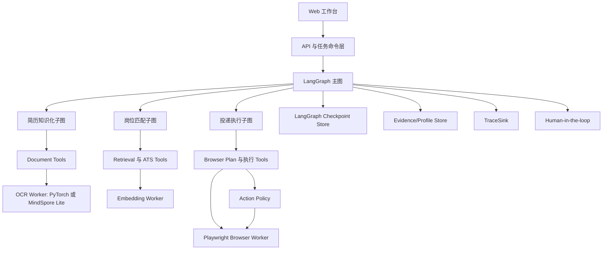
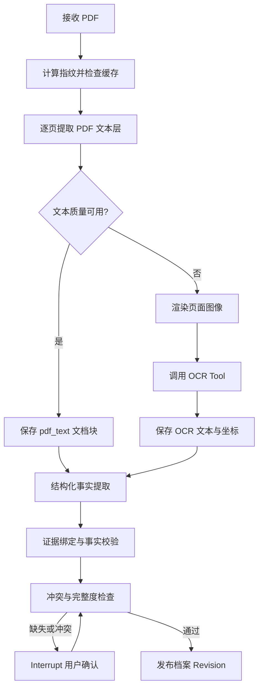
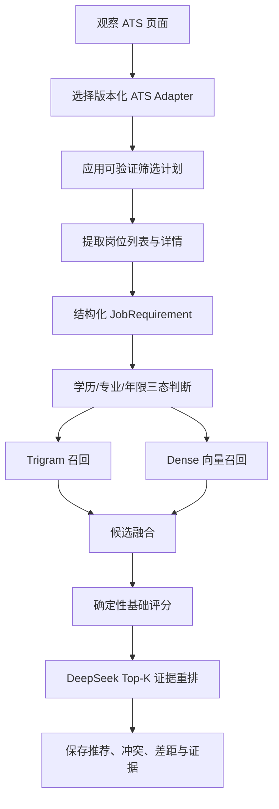
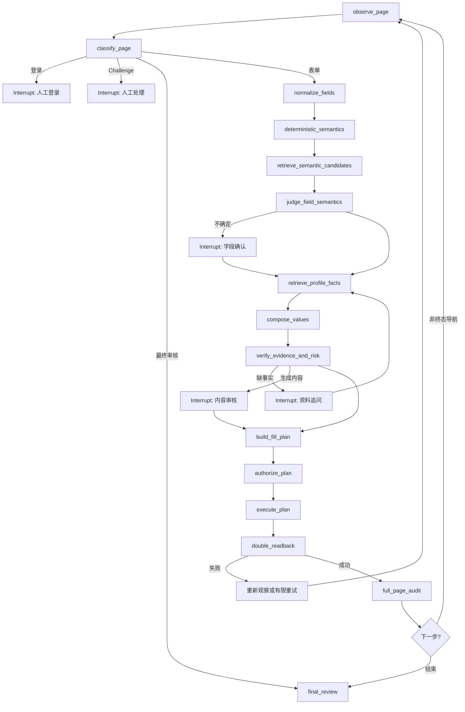

# 智能求职投递 Agent 架构升级设计

日期：2026-08-21

## 1. 文档状态

本文定义简历投递助手从现有应用服务与 XState 编排，升级为以 LangGraph 为唯一流程编排内核的目标架构。升级保留当前简历解析、证据档案、岗位匹配、受控浏览器执行、人工接管和禁止自动提交等能力，同时补齐受限 Tool Calling、统一 Checkpoint、全链路 TraceSink、模型决策审查和离线评测。

本文是目标架构设计，不代表所有目标组件已经在当前代码中实现。特别是：

- 当前 OCR Worker 使用 Transformers/PyTorch 运行固定版本的 DeepSeek OCR 模型；MindSpore Lite 是目标推理后端之一，通过稳定的 OCR Tool 协议替换，不与 LangGraph 迁移强绑定。
- 当前岗位匹配已有 Trigram、Dense 检索、规则评分和受限模型 Advisory；目标架构将其纳入岗位匹配子图，并补齐岗位要求结构化和统一评测。
- 当前投递流程由 XState 与 `ApplicationService` 编排；目标架构最终由 LangGraph 取代 XState，而 Playwright Browser Worker、NodeRef、Action Policy、双稳定回读和提交拦截继续保留。
- 文中准确率、Recall@3、回读成功率和零误提交率必须由固定数据集及评测脚本产生，不能只由架构设计推导。

## 2. 背景与问题

现有系统已经形成四类关键能力：

1. PDF 文本层直读与 OCR 降级、结构化事实提取和原文证据展示。
2. ATS 岗位采集、求职偏好过滤、Trigram 与 Dense 候选检索及岗位评分。
3. 基于 XState 和 Playwright 的受控表单填写、NodeRef 身份校验和双稳定回读。
4. Challenge 人工接管、Execution Epoch 失效、最终审核锁和终态提交硬拦截。

主要架构问题不是缺少单点功能，而是编排、决策、执行、恢复和审计边界不够统一：

- `ApplicationService` 同时承担状态推进、浏览器租约、字段解析、提问审核、恢复、进度和审计协调，修改风险与测试成本持续增大。
- 字段语义识别仍以规则和相似度为主，模型只在部分歧义场景介入，无法系统使用字段选项、区块、相邻字段和风险信息。
- XState 状态、多个内存 Map、进度快照和持久化 Checkpoint 共同表达任务状态，恢复时需要额外同步。
- 岗位匹配、简历知识化和投递执行分别记录局部信息，无法使用统一运行 ID 复盘一次推荐到投递的完整决策路径。
- 模型调用、Tool 调用、证据使用和浏览器实际回读之间没有统一审计协议。

## 3. 设计目标

### 3.1 功能目标

1. 保留 PDF 文本直读优先、低质量页面 OCR 降级和结构化档案能力。
2. 保留 ATS Adapter、岗位过滤、混合检索和岗位推荐能力。
3. 保留受控浏览器填写、动态 DOM 防护、双稳定回读和人工最终提交。
4. 将字段语义识别升级为“确定性规则 + Embedding 候选召回 + LLM 受限裁决”。
5. 统一资料缺失、内容审核、登录、Challenge 和最终审核的人工中断模型。
6. 为所有模型决策和外部副作用提供可检索、可脱敏、可离线回放的审计事件。

### 3.2 架构目标

1. LangGraph 是任务流程与恢复位置的唯一权威来源。
2. 模型只负责理解、分类、排序和内容建议，不直接执行浏览器写操作。
3. 所有写操作都由确定性节点生成、授权、执行和回读。
4. 每个领域能力通过稳定端口暴露，LangGraph 节点不依赖具体模型或浏览器实现。
5. 节点输入输出使用强类型 Schema，模型输出必须在进入图状态前完成校验。
6. Checkpoint、业务数据、证据和 Trace 分开存储，通过稳定 ID 关联。

### 3.3 安全目标

1. 系统永远不自动提交申请。
2. 缺少已确认事实时不生成候选人的客观信息。
3. Challenge 出现时立即冻结当前执行代次并转人工。
4. 页面快照、节点身份或执行代次变化时，旧命令不可继续执行。
5. 普通日志不记录完整简历、手机号、邮箱、证件号等敏感内容。

## 4. 非目标

- 不构建允许多个自由 Agent 相互对话并直接操作浏览器的系统。
- 不让大模型绕过 ATS Adapter 解析任意网页 HTML。
- 不使用模型推理替代学历、专业、年限、终态提交等明确规则。
- 不自动处理验证码、滑块、登录风控或网站反自动化挑战。
- 不在本次升级中扩展到所有招聘网站；继续以现有 Moka/Mokahr 与 DJI 能力为主要基线。
- 不因迁移 LangGraph 而重写已经稳定的 PDF、检索和 Browser Worker 底层实现。
- 不把模型隐藏思维过程保存为审计数据；只保存结构化结论、候选、证据和简短理由。

## 5. 方案选择

### 5.1 备选方案

#### 方案 A：保留 XState，只增强模型调用

改动最小，但无法解决状态源分散、人工中断不统一和全链路审计困难的问题。适合短期字段识别修补，不满足彻底升级目标。

#### 方案 B：LangGraph 与 XState 长期双栈

可以逐步迁移，但两个编排器长期共存会形成双重状态权威，恢复和故障定位更复杂，不适合作为最终架构。

#### 方案 C：LangGraph 成为唯一编排内核，确定性能力保留为 Tool 和 Service

迁移工作量最大，但能够统一条件路由、循环、人工中断、Checkpoint 和运行轨迹，同时复用现有稳定能力。本文选择方案 C。

### 5.2 迁移原则

迁移期间允许使用兼容层调用现有服务，但单个任务只能由一个编排器拥有。新任务进入 LangGraph 后，XState 不再参与该任务的状态决策。旧任务可以继续由旧链路完成，直到迁移窗口结束。

## 6. 总体架构



### 6.1 主图职责

主图不处理领域细节，只负责：

- 创建和恢复任务上下文。
- 根据用户入口调用简历知识化、岗位匹配或投递执行子图。
- 维护任务级 `runId`、`threadId`、用户和资料版本。
- 协调人工中断、取消和终态状态。
- 关联 Checkpoint、Evidence、Trace 和业务实体。

### 6.2 子图边界

| 子图 | 输入 | 输出 | 允许产生的副作用 |
|---|---|---|---|
| 简历知识化 | PDF 文档、用户补充信息 | 标准档案事实与证据 | 保存文档、事实和人工回答 |
| 岗位匹配 | ATS URL、档案版本、求职偏好 | 排序岗位、冲突、差距与证据 | 读取岗位页面、保存岗位与结果 |
| 投递执行 | 已选岗位、档案版本、申请 URL | 填写结果、审核材料 | 受控填写、非终态导航、人工中断 |

## 7. 统一图状态

图状态只保存推进流程所需的引用和小型决策对象，不复制完整 PDF、页面图片或长期业务表。

```ts
interface AgentGraphState {
  threadId: string;
  runId: string;
  taskId: string;
  graphVersion: string;
  status: "running" | "interrupted" | "completed" | "failed" | "cancelled";

  profileRevision: number;
  expectationRevision?: number;
  selectedJobId?: string;

  currentSubgraph: "resume_ingestion" | "job_matching" | "application";
  currentNode?: string;
  pendingInterrupt?: HumanInterrupt;

  resumeIngestion?: ResumeIngestionState;
  jobMatching?: JobMatchingState;
  application?: ApplicationExecutionState;

  error?: GraphError;
  auditEventIds: string[];
}
```

状态更新遵循以下规则：

- 节点只返回自己负责的增量字段。
- 列表字段使用显式 reducer，禁止依赖隐式覆盖。
- 大对象只保存仓储 ID 与内容哈希。
- 每次外部副作用前后都产生 Checkpoint 和 Trace Event。
- `graphVersion` 与节点版本用于恢复兼容和离线回放。

## 8. 简历知识化子图

### 8.1 流程



### 8.2 文本直读与 OCR 降级

延续现有逐页质量判断：可见字符过少、替换字符比例过高或控制字符异常时才进入 OCR。OCR 后端通过端口隔离：

```ts
interface OcrTool {
  recognize(input: {
    documentId: string;
    page: number;
    imageObjectId: string;
  }): Promise<{
    text: string;
    blocks?: Array<{ text: string; bbox: [number, number, number, number] }>;
    model: string;
    modelRevision: string;
    runtime: "pytorch" | "mindspore_lite";
  }>;
}
```

因此可以先保留当前 OCR Worker，再以相同协议替换为 MindSpore Lite 模型。替换后需要分别验证识别准确率、坐标质量、显存或内存、吞吐和冷启动时间。

### 8.3 结构化事实提取

DeepSeek 接收带页面边界的文档块，输出固定 Schema：

```ts
interface ExtractedFactCandidate {
  fieldPath: string;
  value: JsonValue;
  confidence: number;
  evidence: Array<{
    documentId: string;
    page: number;
    quote: string;
    blockId?: string;
  }>;
}
```

候选只有同时满足以下条件才能进入档案：

- `fieldPath` 存在于标准档案 Schema。
- `value` 符合字段类型和约束。
- 页码存在于当前文档。
- `quote` 可以在标准化后的对应页面文本中定位。
- OCR 坐标存在时，`blockId` 与文本块一致。
- 相同字段的冲突候选不会静默覆盖。

### 8.4 缺失项追问

完整度节点根据使用场景生成缺失项，不要求用户一次补齐整个档案：

- 推荐岗位前检查目标岗位、地点等求职偏好。
- 填写当前页面前只检查页面所需事实。
- 客观身份和经历事实缺失时必须 Interrupt。
- 可选字段缺失时允许跳过，但写入覆盖率与审计原因。

用户回答保存为 `user_confirmed` 或 `user_corrected` 事实，并保留回答时间、作用域和替代关系。

## 9. 岗位匹配子图

### 9.1 流程



### 9.2 ATS Adapter 契约

Adapter 只处理网站差异，不承担匹配决策：

```ts
interface AtsJobAdapter {
  source: JobSource;
  version: string;
  supports(url: URL): boolean;
  detect(snapshot: JobPageSnapshot): "list" | "detail" | "unsupported";
  buildFilterPlan(expectation: JobExpectationSnapshot): FilterPlan;
  extractPostings(snapshot: JobPageSnapshot): RawJobPosting[];
  normalizePosting(raw: RawJobPosting): JobPosting;
}
```

所有 Adapter 输出统一 `JobPosting`，包含稳定来源 ID、规范 URL、岗位原文、结构化要求、内容哈希和 Adapter 版本。页面不符合契约时返回 `adapter_contract_mismatch`，禁止让模型猜测页面结构。

### 9.3 岗位要求拆解

要求拆解采用“规则优先、模型补充、原文校验”：

1. 按职责、任职要求、加分项等区块保留上下文。
2. 按换行、编号和分号切分句子。
3. 使用规则提取学历、专业、年限、地点、用工类型和明确技能。
4. 使用技能别名表归一化技术词。
5. 复杂复合句交给 DeepSeek 输出结构化候选。
6. 每个候选必须携带原文连续片段和字符位置。
7. 去重时合并证据，不丢失更严格的数值约束。

```ts
interface JobRequirement {
  id: string;
  category: RequirementCategory;
  operator: "eq" | "gte" | "lte" | "contains" | "related_to";
  normalizedValue: JsonValue;
  scope?: string;
  required: boolean;
  confidence: number;
  sourceSpan: {
    section: "responsibilities" | "qualifications" | "preferred";
    start: number;
    end: number;
    text: string;
  };
}
```

### 9.4 三态硬约束

学历、专业和年限不使用简单布尔过滤：

- `satisfied`：档案存在已确认事实且满足要求。
- `conflict`：档案存在已确认事实且明确不满足要求。
- `unknown`：档案证据不足，不能当作不满足。

`conflict` 岗位进入冲突列表，`unknown` 岗位可以继续参与排序，但降低置信度并展示缺失证据。

### 9.5 混合召回和模型重排

Trigram 与 Dense 并行检索，候选使用 RRF 或版本化加权公式融合。检索方向包括：

- 岗位要求到候选人事实，用于寻找支持或冲突证据。
- 候选人技能与目标偏好到岗位要求，用于提高岗位发现覆盖。

DeepSeek 只处理融合后的 Top-K，按技能、职责、项目、资质和偏好输出结构化排序建议。模型不能改变硬约束结果，也不能引用候选集合之外的事实 ID。模型不可用时退化到确定性评分。

## 10. 投递执行子图

### 10.1 流程



### 10.2 字段语义裁决

执行顺序固定为：

1. ATS 已认证字段目录和精确别名。
2. 基于标签、类型、区块和选项召回受控语义候选。
3. DeepSeek 在候选集合内进行结构化裁决。
4. 高风险字段、低置信度或无安全候选时转人工。

模型输入只包含当前决策所需上下文：字段标签、控件类型、选项、区块、重复项索引、相邻字段和候选语义定义。模型输出：

```ts
interface SemanticDecision {
  decisionId: string;
  fieldId: string;
  status: "mapped" | "needs_review" | "unresolved";
  selectedSemantic?: string;
  confidence: number;
  candidateAssessments: Array<{
    semantic: string;
    supportingSignals: string[];
    conflictingSignals: string[];
  }>;
  reasonSummary: string;
}
```

程序必须验证 `selectedSemantic` 属于召回候选，禁止模型新造字段路径。

### 10.3 值解析与内容生成

语义确定后，RAG 只负责检索已确认事实和证据。值节点负责日期格式、布尔值、选项和有限别名对齐。处理规则：

- 客观字段必须来自已确认档案事实或当前任务人工回答。
- 选项对齐必须命中唯一候选，歧义时转人工。
- 开放题可以由模型基于证据生成草稿，但必须进入内容审核。
- 生成内容中的每个客观主张必须关联事实 ID。
- 模型无法获得直接浏览器写 Tool。

### 10.4 填写计划与授权

模型决策先转换成不可变填写计划：

```ts
interface FillOperation {
  operationId: string;
  taskId: string;
  snapshotId: string;
  executionEpoch: number;
  fieldId: string;
  nodeRef: NodeRef;
  operation: "fill" | "select" | "upload";
  value: JsonValue;
  semantic: string;
  decisionId: string;
  evidenceIds: string[];
  expectedCurrentValue: JsonValue;
}
```

Action Policy 为通过校验的操作签发短时、一次性 HMAC 令牌。令牌绑定任务、快照、节点、操作类型、Execution Epoch 和过期时间。Browser Worker 验签并消费后才执行。

### 10.5 NodeRef 和双稳定回读

继续保留现有 NodeRef 与 ControlTransaction 思路：

```text
校验 documentId/nodeId/observedAt
  -> 等待控件与容器稳定窗口
  -> 执行一次写入
  -> 触发控件所需事件
  -> 等待稳定窗口
  -> 第一次回读
  -> 再次等待稳定窗口
  -> 第二次回读
  -> 两次匹配后提交操作结果
```

任何节点断连、角色变化、Mutation Epoch 变化、两次回读不一致或执行代次失效都会终止当前事务。图重新观察页面后才能生成新计划。

### 10.6 最终提交三层硬拦截

1. LangGraph 中不存在自动提交边或 `submit_application` Tool。
2. Action Policy 拒绝 `terminal_submit`、未知副作用和非法中间操作。
3. Browser Worker 拦截原生 submit 事件、脚本提交和未授权终态网络行为。

`final_review` 是持久化人工中断，而不是可以由模型自动离开的普通节点。

## 11. Tool Calling 设计

### 11.1 工具分级

| 级别 | 示例 | 模型可直接调用 | 是否有外部副作用 |
|---|---|---:|---:|
| 只读感知 | 页面观察、字段上下文、文档块读取 | 是 | 否 |
| 只读检索 | 语义候选、档案事实、岗位证据 | 是 | 否 |
| 计划生成 | 填写计划、筛选计划 | 否，由确定性节点调用 | 否 |
| 受控写入 | 填写、选择、上传、非终态导航 | 否 | 是 |
| 禁止能力 | 自动登录、验证码破解、最终提交 | 不存在 | 是 |

### 11.2 统一结果协议

```ts
interface ToolResult<T> {
  ok: boolean;
  data?: T;
  error?: {
    code: string;
    message: string;
    retryable: boolean;
  };
  meta: {
    toolCallId: string;
    toolName: string;
    toolVersion: string;
    startedAt: string;
    durationMs: number;
    inputHash: string;
    outputHash: string;
  };
}
```

节点不解析任意异常字符串。Tool Adapter 将底层错误转换成稳定错误码，并由条件边决定重试、降级、人工接管或失败。

## 12. Human-in-the-loop

所有人工接管使用统一中断协议：

```ts
interface HumanInterrupt {
  interruptId: string;
  type:
    | "login_required"
    | "challenge_required"
    | "missing_profile_fact"
    | "semantic_confirmation"
    | "content_review"
    | "final_review";
  title: string;
  payload: RedactedJson;
  resumableBy: string[];
  createdAt: string;
}
```

恢复要求：

- 使用同一 `threadId` 恢复 Checkpoint。
- 校验中断 ID 尚未消费。
- 浏览器相关中断恢复后必须重新观察页面。
- 用户答案先写入业务仓储，再以引用更新图状态。
- 最终审核只能由用户执行外部提交或取消，图本身不执行提交。

## 13. Challenge 熔断

Challenge 检测覆盖验证码、滑块、登录风控、频率限制和异常验证页面。发现 Challenge 时按顺序执行：

1. 当前 `executionEpoch` 加一。
2. 通知 Browser Worker 作废旧代次命令。
3. 取消当前节点尚未完成的写操作。
4. 保存最新页面快照引用和 Checkpoint。
5. 写入脱敏 Challenge Diagnostic。
6. 进入 `challenge_required` Interrupt。

用户处理完成后重新观察页面。Challenge 仍存在则保持中断；Challenge 消失后，从页面分类节点重新进入流程，不恢复旧填写计划。

## 14. Evidence 与 TraceSink

### 14.1 证据模型

证据是业务事实的来源，不等同于运行日志：

```ts
interface EvidenceReference {
  evidenceId: string;
  sourceType: "pdf_text" | "ocr" | "user" | "job_page";
  sourceId: string;
  page?: number;
  quote: string;
  bbox?: [number, number, number, number];
  contentHash: string;
}
```

档案事实、岗位要求、匹配结论、字段值决策和生成内容都通过 Evidence ID 关联来源。

### 14.2 TraceSink

```ts
interface TraceSink {
  append(event: TraceEvent): Promise<void>;
  list(runId: string): Promise<TraceEvent[]>;
  exportRedacted(runId: string): Promise<RedactedTraceBundle>;
}
```

```ts
interface TraceEvent {
  eventId: string;
  runId: string;
  taskIdHash: string;
  graphVersion: string;
  nodeName: string;
  nodeVersion: string;
  eventType:
    | "node_started"
    | "node_completed"
    | "tool_called"
    | "model_decided"
    | "plan_authorized"
    | "browser_executed"
    | "readback_verified"
    | "human_interrupted"
    | "human_resumed"
    | "error";
  inputHash: string;
  outputSummary: RedactedJson;
  candidateIds?: string[];
  selectedId?: string;
  confidence?: number;
  evidenceIds?: string[];
  model?: {
    provider: string;
    model: string;
    promptVersion: string;
    responseId?: string;
    tokenUsage?: number;
  };
  durationMs: number;
  errorCode?: string;
  createdAt: string;
}
```

### 14.3 脱敏规则

- 普通 Trace 只保存任务 ID 哈希和内容哈希。
- 手机号、邮箱、证件号、地址和姓名按类型脱敏。
- 模型输入和输出默认只保存 Schema 摘要、候选 ID 和选择结果。
- 本地原始审计需要单独加密密钥和保留期限。
- Bad Case 导出默认不包含原始 PDF、完整页面文本和浏览器存储状态。

## 15. Checkpoint 与数据一致性

存储分为四类：

| 存储 | 内容 | 一致性要求 |
|---|---|---|
| LangGraph Checkpoint | 图状态、下一节点、中断 | 每个副作用边界前后保存 |
| 业务仓储 | 档案、岗位、匹配结果、任务 | 使用版本号和幂等键 |
| Evidence Store | 文档块、引用、坐标、哈希 | 内容寻址，不可静默覆盖 |
| Trace Store | 追加式运行事件 | 只追加，允许异步落盘 |

所有外部副作用使用幂等键：

```text
runId + nodeName + nodeAttempt + operationId
```

浏览器写操作还必须绑定 `snapshotId + NodeRef + executionEpoch`。Checkpoint 恢复后，系统先查询幂等结果；无法确认操作是否成功时，先重新观察和回读，不盲目重放。

## 16. 错误处理与降级

| 故障 | 处理方式 |
|---|---|
| OCR 不可用 | 文本页继续；需要 OCR 的页面标记导入不可用，不生成空事实 |
| Embedding 不可用 | 降级为精确规则和 Trigram；降低置信度并记录健康状态 |
| DeepSeek 不可用 | 使用确定性结果；需要模型裁决的字段转人工 |
| 模型输出不符合 Schema | 有限重试一次；再次失败转人工或确定性降级 |
| ATS Adapter 契约不匹配 | 停止自动提取，记录 Adapter 版本和页面哈希 |
| Browser Worker 断开 | 作废执行代次，保存 Checkpoint，等待安全恢复 |
| NodeRef 失效 | 终止当前事务，重新观察页面，不复用旧命令 |
| 回读不一致 | 有限安全重试；页面变化或重复项操作不自动重试 |
| Challenge | 立即熔断并转人工 |
| 最终审核页 | 持久化中断，永不自动提交 |

## 17. 目录与模块边界

目标目录建议：

```text
apps/api/src/agent/
  graph.ts
  state.ts
  interrupts.ts
  resume-ingestion/
  job-matching/
  application/

apps/api/src/tools/
  document/
  retrieval/
  ats/
  browser/

packages/agent-contracts/
packages/evidence-store/
packages/audit/
packages/action-policy/
packages/job-matching/
packages/profile-domain/

services/ocr-worker/
services/embedding-worker/
apps/browser-worker/
```

现有 `profile-domain`、`job-matching`、`action-policy` 和 Browser Worker 继续作为独立领域或基础设施包。LangGraph 节点通过端口调用它们，不把领域算法复制到节点文件中。

## 18. 迁移计划

### 阶段 1：契约和可观测性基座

- 定义 Graph State、ToolResult、HumanInterrupt、EvidenceReference 和 TraceEvent Schema。
- 建立 LangGraph Checkpoint 与统一 TraceSink。
- 为现有 PDF、检索和 Browser Worker 提供 Tool Adapter。
- 不改变当前线上任务行为。

### 阶段 2：简历知识化子图

- 将现有 PDF、OCR、结构化提取和完整度检查接入 LangGraph。
- 使用统一 Interrupt 完成缺失项追问。
- 保持现有 ProfileFact 与 Evidence 数据兼容。

### 阶段 3：岗位匹配子图

- 接入现有 ATS Adapter、Trigram、Dense 和确定性评分。
- 增加岗位要求结构化与原文 Span 校验。
- 将 DeepSeek Advisory 升级为 Top-K 受限重排。
- 建立 Recall@K 和硬条件误判评测。

### 阶段 4：投递执行子图

- 迁移页面分类、字段解析、提问审核、填写、回读和翻页循环。
- 保留 Browser Worker、NodeRef、Action Policy 和 Execution Epoch。
- 将字段模型升级为候选集合内受限裁决。
- 使用 LangGraph Interrupt 替代 XState 人工暂停状态。

### 阶段 5：切换唯一状态源

- 新任务全部由 LangGraph 创建和恢复。
- 旧 XState 任务仅完成存量执行，不再创建新任务。
- 验证恢复、取消、Challenge 和最终审核后删除 XState 编排及冗余内存状态。

### 阶段 6：MindSpore Lite 推理替换

- 在不改变 Tool 协议的前提下实现 MindSpore Lite OCR 和 Embedding Backend。
- 对比当前模型的准确率、时延、吞吐、资源占用和坐标质量。
- 只有评测达到门槛后切换默认运行时；否则继续使用当前 Backend。

## 19. 测试与评测

### 19.1 图单元测试

- 每个节点的输入输出 Schema 与条件边。
- 模型输出候选越界、事实越界和证据缺失时被拒绝。
- Interrupt 创建、重复恢复和错误恢复。
- Checkpoint 在节点失败、进程重启和人工暂停后的恢复位置。
- Tool 错误码到重试、降级和中断路由的映射。

### 19.2 领域测试

- PDF 文本质量分类和逐页 OCR 降级。
- 事实字段 Schema、Quote、页码和坐标证据校验。
- 岗位要求区块、原子条件、硬约束和技能别名解析。
- Trigram、Dense、融合评分和模型不可用降级。
- NodeRef、一次性令牌、Execution Epoch 和双稳定回读。

### 19.3 浏览器集成测试

- 原生输入、自定义搜索下拉、单选、日期、文件上传和重复区块。
- React/Vue 重渲染导致节点替换时旧 NodeRef 失效。
- 显示值变化但内部值未提交时回读失败。
- Challenge 出现后在途操作停止，恢复后不重放旧命令。
- 所有终态提交路径均被拦截。

### 19.4 离线评测

建立版本化数据集和评测命令，至少报告：

| 能力 | 指标 | 必须同时报告 |
|---|---|---|
| 简历事实提取 | 字段级 Precision、Recall、F1 | 文档数、版式分布、OCR 页比例 |
| 岗位推荐 | Recall@3、NDCG@3 | 岗位数、标注方法、硬冲突错误率 |
| 字段语义 | Top-1 Accuracy、人工接管率 | ATS、字段类别和风险分层 |
| 浏览器填写 | 一次性双回读成功率 | 控件类型、页面数、重试后成功率 |
| 提交安全 | 未授权提交次数 | 测试场景数、拦截层和网络结果 |

“核心事实准确率 92%”“Recall@3 85%”“一次性回读成功率 94%”“零误提交”只有在固定数据集、指标定义和原始报告可复现时才能对外使用。

## 20. 验收标准

### 20.1 架构验收

- 新任务只有 LangGraph 一个流程状态源。
- 三个子图可独立测试，并通过稳定契约组合。
- 所有模型输出在进入图状态前通过 Schema 和候选边界校验。
- 所有浏览器写操作都经过不可绕过的 Action Policy。
- Checkpoint 可以恢复人工中断和非终态故障，不重复执行已确认副作用。

### 20.2 功能回归

- 文本 PDF 不调用 OCR，扫描或低质量页面按页降级 OCR。
- 每个档案事实可以回到原文页码和 Quote；OCR 证据可以定位坐标或明确降级为页级证据。
- ATS 岗位仍可采集、过滤、匹配、排序和转换为投递任务。
- 现有受支持 ATS 的字段填写覆盖率不低于迁移前基线。
- 登录、资料缺失、内容审核、Challenge 和最终审核均可人工恢复。

### 20.3 安全验收

- 模型不能获得浏览器写 Tool 或自动提交 Tool。
- Challenge 出现后所有旧 Execution Epoch 命令均失败。
- 过期、重放、节点不匹配或快照不匹配的授权令牌均被拒绝。
- 原生表单提交、脚本提交、提交按钮和未知终态操作均无法通过自动化执行。
- 脱敏 Trace 导出不包含完整敏感字段或原始文档内容。

## 21. 关键架构结论

1. LangGraph 负责流程、循环、中断和恢复，不负责替代领域算法。
2. DeepSeek 负责受限语义判断和证据排序，不负责创造事实或直接控制浏览器。
3. ATS Adapter 负责网站差异，统一岗位协议负责隔离下游匹配逻辑。
4. RAG 负责找到证据，规则与 Schema 负责决定证据能否用于填写。
5. Playwright Browser Worker 继续是唯一浏览器副作用执行边界。
6. TraceSink 记录可审查结论和来源，不记录隐藏思维过程。
7. 最终提交通过图、策略和 Worker 三层禁止，始终由用户完成。

